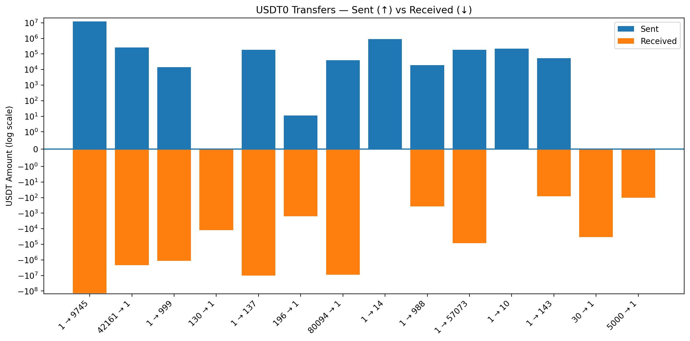

# USDT0 Indexer

*For a complete overview of all Envio indexer features, please visit the [Envio documentation](https://docs.envio.dev).*

This indexer tracks cross-chain USDT transfers done via **USDT0** across all HyperSync-supported networks.

## Running the Indexer

```bash
pnpm dev
```

Once running, open **[https://envio.dev/console](https://envio.dev/console)** to access the GraphQL Playground.

## Generate Types

If you make changes to config.yaml or schema.graphql, run the command below to regenerate the corresponding type files:

```bash
pnpm codegen
```

## Requirements

- [Node.js v18+](https://nodejs.org/en/download/current)
- [pnpm v8+](https://pnpm.io/installation)
- [Docker Desktop](https://www.docker.com/products/docker-desktop/)

## Visualize Data

You can view graphs of incoming and outgoing transfers by running the Marimo notebook locally. Before launching the notebook, ensure that Marimo is installed and your indexer is running. Run the following command to run the notebook:

```bash
cd dashboard && marimo edit visualize_data.py
```

Below is an example of a divergent bar chart that illustrates incoming and outgoing transfers across chains. Note that this is an early visualization, it doesn’t represent final or fully accurate data, and the values may change as the indexer logic evolves. It also only includes transfers from a single day indexed on the Ethereum chain.



